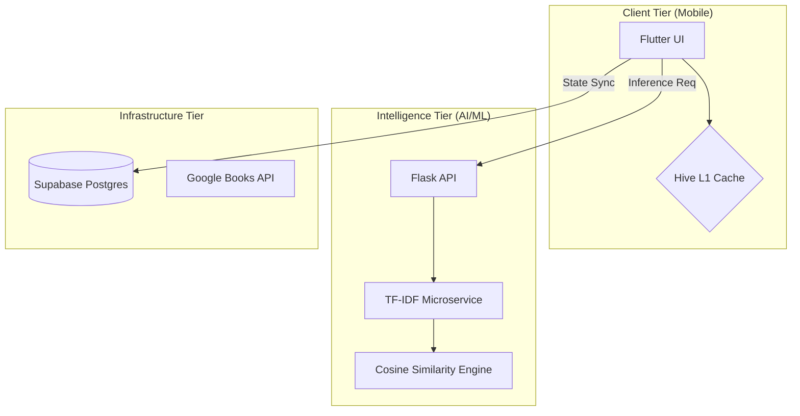

# 🏛️ Libris Architecture: Strategic System Design

Bu doküman, Libris ekosisteminin teknik tasarım kararlarını, veri akışını ve mühendislik prensiplerini detaylandırmaktadır.

---

## 1. High-Level Concept
Libris, **"Intelligence-At-The-Edge"** ve **"Cloud-First Persistence"** prensiplerini birleştirir. Sistem, istemci tarafında maksimum hız (L1 Cache) ve bulut tarafında merkezi tutarlılık (PostgreSQL) sağlar.

### **📐 System Topology**

---

## 2. Intelligence Core (ML Logic)
Öneri motoru, **Content-Based Filtering** (İçerik Tabanlı Filtreleme) ve **Hybrid Metadata Weighting** tekniklerini kullanır.

### **⚙️ Vector Space Model**
1. **TF-IDF Vectorization:** Her kitap, açıklaması ve türüne göre (Descriptive + Categorical) bir özellik vektörüne dönüştürülür.
2. **Cosine Similarity:** İki vektör (kitap) arasındaki benzerlik, aralarındaki açının kosinüsüyle hesaplanır:
   $$\text{similarity} = \cos(\theta) = \frac{\mathbf{A} \cdot \mathbf{B}}{\|\mathbf{A}\| \|\mathbf{B}\|}$$
3. **Gaussian Weighting:** Kullanıcının sayfa sayısı tercihi, bir çan eğrisi (Gaussian distribution) üzerinden normalleştirilerek popülerlik puanına eklenir.

---

## 3. Data Strategy & Persistence
Veri tutarlılığını sağlamak için **Eşzamanlı (Concurrent) Senkronizasyon** kullanılır.

- **Storage:** Metadata Supabase üzerinde, büyük görseller Google Books API üzerinden yönetilir.
- **Offline Resilience:** Hive NoSQL veritabanı, internet kesintilerinde UI'ın "frozen" (donmuş) durumda kalmasını engeller.
- **Sync Cycle:** Uygulama açılışında Supabase'den fark (diff) çekilerek Hive güncellenir.

---

## 4. Scalability & Engineering Standards
1. **O(1) Search:** Vektörler bellek içinde indekslendiği için arama süresi veri seti büyüse de sabit kalır.
2. **Atomic UI Rebuilds:** Flutter `Selector` kullanımı ile sadece değişen widget'ların rebuild edilmesi sağlanır.
3. **Stateless Backend:** Flask API'si tamamen durumsuz (stateless) olup, talebe göre yatayda (Horizontal Scalability) ölçeklenebilir.

---
**Libris v2.2.0** — *Engineering Excellence.*
